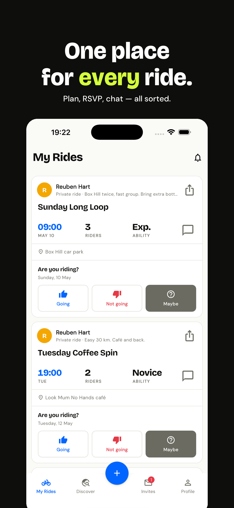

# Pelori marketing site

Static landing page for **pelori.fit**. Pure HTML + CSS, no build
step, deploys anywhere that serves files.

## Layout

```
pelori_website/
├── index.html        landing
├── privacy.html      rendered from velora_app/docs/privacy.md
├── terms.html        rendered from velora_app/docs/terms.md
├── styles.css        brand styling (mirrors the in-app design tokens)
├── robots.txt
├── sitemap.xml
├── .well-known/
│   └── apple-app-site-association
└── assets/
    ├── apple-touch-icon.png
    ├── logos/
    └── screenshots/  (subset of the App Store marketing PNGs)
```

## Deploy

Pick whichever's easiest — all are free for a single static site:

### Cloudflare Pages (recommended)

```bash
# From this folder, push to a git repo and connect via the
# Cloudflare dashboard. Build settings:
#   Build command:   (leave blank)
#   Output directory: /
```

Cloudflare auto-issues TLS for `pelori.fit`; add it as a custom domain
in the Pages project settings and it will manage the DNS.

### GitHub Pages

```bash
# Push to a github repo, enable Pages on main branch root, point
# pelori.fit's CNAME at <user>.github.io.
```

### Plain S3 + CloudFront

```bash
aws s3 sync . s3://pelori.fit/ --delete --exclude README.md
# then attach a CloudFront distribution + ACM cert + Route53 record
```

## Local preview

```bash
python3 -m http.server 8000 --directory pelori_website
open http://localhost:8000
```

## Re-rendering legal pages

`privacy.html` and `terms.html` are generated from
`velora_app/docs/privacy.md` and `velora_app/docs/terms.md`. To
regenerate after editing the source markdown:

```bash
python3 /tmp/render_legal.py
```

(That script lives in /tmp and just wraps the markdown body in the
site's HTML chrome. Re-run anytime the source changes; commit the
resulting .html files.)

## Adding or editing translations

The site is translated client-side: each page tags its translatable
elements with `data-i18n` (or its sibling attributes), and
[`assets/i18n.js`](assets/i18n.js) swaps the content on DOM ready
based on the user's chosen locale.

### How the runtime works

1. `assets/i18n.js` defines a single `T` object keyed by locale code
   (`en`, `nl`, `fr`, `es`, `it`). Each value is a flat
   `{ 'key.path': 'string' }` map.
2. On `DOMContentLoaded` the script picks a locale (priority: `?lang=`
   query param → `localStorage('pelori-lang')` → `navigator.language`
   → English fallback) and walks the DOM:
   - `data-i18n="key"` → set `el.textContent` to the translation.
   - `data-i18n-html="key"` → set `el.innerHTML` (use sparingly; only
     for strings that need inline markup, like the hero accent span).
   - `data-i18n-alt="key"` → set `el.alt` (image alt text).
3. `<title>`, `<meta name="description">`, and the OG meta tags are
   updated separately from the `meta.title` / `meta.description` keys.
4. `{year}` inside any string is substituted with the current year at
   apply time — used by the footer copyright line.

### Adding a new translatable string

1. Add a key to **every** locale block in `assets/i18n.js`:
   ```js
   const T = {
     en: {
       // ...existing keys
       'features.new.title': 'My new feature',
     },
     nl: { /* ... */ 'features.new.title': 'Mijn nieuwe functie', },
     fr: { /* ... */ 'features.new.title': 'Ma nouvelle fonction', },
     // …same for es / it
   };
   ```
   Keys missing from a non-English locale fall back to the English
   value at runtime, but the convention is "all locales carry every
   key" so a forgotten translation is visible in code review, not
   discovered in production.

2. Tag the markup:
   ```html
   <h3 data-i18n="features.new.title">My new feature</h3>
   ```
   The literal text inside the tag is the English fallback that's
   visible until the JS runs (and to crawlers that don't execute
   JS), so keep it accurate.

3. Reload the page — no build step.

### Locale-keyed images

The `data-i18n-src` attribute swaps an ``'s source per locale.
Drop `{lang}` into the path where the locale code should land:

```html

```

Used by the marketing screenshots on the home page — each locale's
captured-and-composed PNGs live in `assets/screenshots/<lang>/` and
the JS substitutes `{lang}` for the active code on apply. The
default `src` should point at the English copy so the initial
paint (and crawlers that don't run JS) sees a real image.

The screenshot PNGs themselves come from
`velora_app/marketing/screenshots/composed-6.9/<lang>/`. After a
fresh capture + compose pass, copy the four panels the home page
embeds (`02-my-rides.png`, `03-chat.png`, `05-discover.png`,
`06-where-tab.png`) into the matching `assets/screenshots/<lang>/`.
See `velora_app/marketing/screenshots/raw/README.md` for the
capture process.

### Translating a new page

If you add e.g. `blog.html`:

1. Wrap its `<head>` and `<body>` chrome (nav + footer) in the same
   `data-i18n` attributes used by `index.html`. Easiest: copy the
   header / footer markup verbatim.
2. Add `<script src="assets/i18n.js"></script>` just before
   `</body>`.
3. Tag the page-specific content with new keys (e.g. `blog.title`,
   `blog.intro`) and add them to every locale block in
   `assets/i18n.js`.
4. Make sure the `<select id="lang-select" class="lang-select"
   aria-label="Language">` tag is present in the nav — `i18n.js`
   populates and wires it on every page that has it.

### Adding a new language

1. Add the new code to the `SUPPORTED` array and the `NATIVE_NAMES`
   map at the top of `assets/i18n.js`. Use the language's *native*
   name (e.g. `de: 'Deutsch'`).
2. Add a complete locale block to the `T` object, copying the
   English block as a starting point and translating every value.
3. Drop a flag SVG at `assets/flags/<code>.svg` (the existing files
   are simple flat SVGs at the country's standard aspect ratio —
   match the pattern). Add a corresponding rule to `styles.css`:
   ```css
   .lang-flag.lang-de { background-image: url('assets/flags/de.svg'); }
   ```
4. (Optional) Update the app's ARBs in
   `velora_app/lib/l10n/` if you want the in-app and the marketing
   site to ship the same language set. The lists aren't coupled at
   runtime — they're only "the same" by convention.

### Legal pages are deliberately English-only

`privacy.html` and `terms.html` get the same selector and
chrome translations as the home page, but their **bodies stay
English**. When a non-English chrome is active the
`data-legal-en-only` banner unhides itself and tells the user
why. Translating GDPR / CCPA-flavoured copy needs more care than
marketing strings; treat it as a separate exercise (and probably
one with a lawyer in the loop).

The body comes from `velora_app/docs/privacy.md` /
`docs/terms.md` via `/tmp/render_legal.py` — the Markdown gets
wrapped in the same chrome template every time, so re-running
the renderer carries any chrome changes from the template into
both pages automatically.

### Testing locally

```bash
python3 -m http.server 8000 --directory pelori_website
# Then in the browser:
#   http://localhost:8000              ← uses navigator.language
#   http://localhost:8000?lang=fr      ← forces French
#   http://localhost:8000?lang=it      ← forces Italian
# Switching the dropdown writes localStorage('pelori-lang') so
# subsequent visits without ?lang= remember the choice.
```

DevTools tip: `localStorage.removeItem('pelori-lang')` then refresh
to test the first-visit path.

## Things that need real values before launch

- **`<meta name="apple-itunes-app" content="app-id=PLACEHOLDER">`** in
  `index.html`. Replace `PLACEHOLDER` with the App Store Connect
  numeric app id once Pelori is published. Lets iOS Safari show the
  Smart Banner that opens the app if installed.
- **`apple-app-site-association`** has the team id `U2D4FG73A9`
  hard-coded — confirm that's correct for the App Store Connect
  team id before deploying. Universal Links to `/rides/*` will then
  open the iOS app instead of the web page.
- **Custom Open Graph image** — currently re-uses `02-my-rides.png`.
  Worth designing a dedicated 1200×630 social-card image once the
  brand is settled.

## Things deliberately not done

- **Email capture form** — would need a backend (Mailchimp, Buttondown,
  ConvertKit, …). Skipped to keep the site static.
- **Blog / changelog** — same reason, plus there's nothing to write
  about yet.
- **Premium / IAP messaging** — gated until the upgrade flow ships in
  the app. The current copy reflects only the standard tier.
